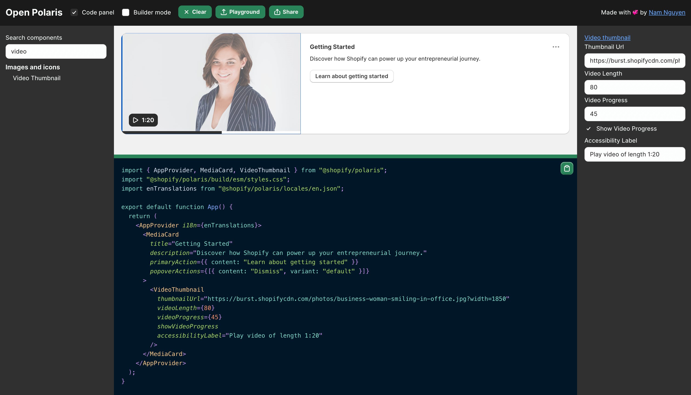

# Open Polaris 🐻‍❄️

Open Polaris is a drag and drop UI playground for [Polaris Design System](https://polaris.shopify.com) components.

👉 [https://openpolaris.netlify.app](https://openpolaris.netlify.app)

## Features

- 🖱️ Drag and drop [Polaris React](https://polaris.shopify.com) components
- 💳 Props editing
- 💽 Live preview
- 🧬 Code generation
- 🛝 Stackblitz export playground
- 🎨 100% built by Polaris components
- 🕸️ Sharable via url

## Roadmap

- [ ] Increase the size of the heading itself and right align the docs link
- [ ] Auto select any new component that was just dragged into the art board
- [ ] Add simple prebuilt templates for the most commonly built component layouts for apps
- [ ] Let the user cycle through the components using their up / down arrows

## Credits

- [OpenChakra](https://github.com/premieroctet/openchakra) - The inspiration for this project 🙂
